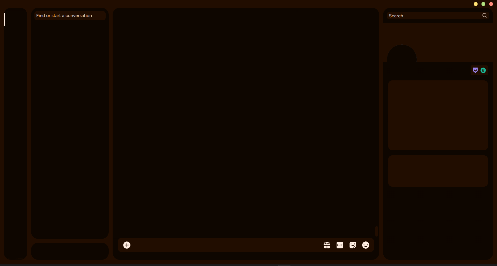
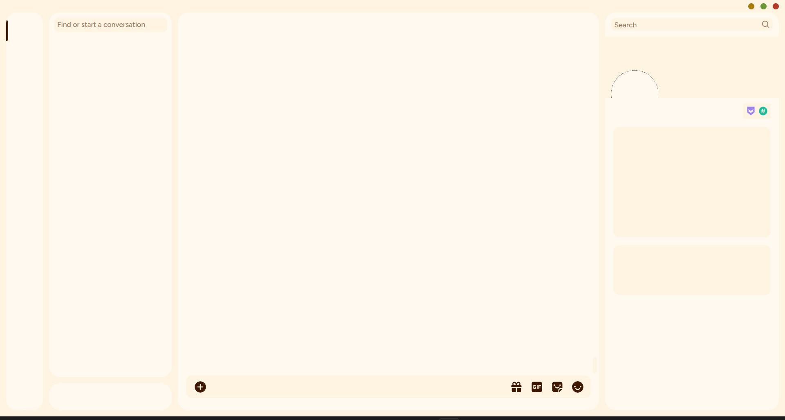

<div align="center">


### Whiskers for [Discord](https://discord.com/)

<div>
    
    
</div>
</div>

## 😊 Thanks To

This theme uses the [midnight](https://github.com/refact0r/midnight-discord) theme under the hood.

## 👷‍♂️ Install

- Install a discord client like [vencord](https://vencord.dev/) to be able to import themes

- Go to theme settings and import the css:

    <details open>
    <summary>🐈‍⬛ Panther</summary>

  🍌 Banana

  ```css
  @import url('https://raw.githubusercontent.com/Whiskers-Color-Scheme/discord/main/themes/panther/banana.css')
  ```

  🍒 Cherry

  ```css
  @import url('https://raw.githubusercontent.com/Whiskers-Color-Scheme/discord/main/themes/panther/cherry.css')
  ```

  🫐 Blueberry

  ```css
  @import url('https://raw.githubusercontent.com/Whiskers-Color-Scheme/discord/main/themes/panther/blueberry.css')
  ```

  🥝 Kiwi

  ```css
  @import url('https://raw.githubusercontent.com/Whiskers-Color-Scheme/discord/main/themes/panther/kiwi.css')
  ```

  🍇 Grape

  ```css
  @import url('https://raw.githubusercontent.com/Whiskers-Color-Scheme/discord/main/themes/panther/grape.css')
  ```

  🍊 Tangerine

  ```css
  @import url('https://raw.githubusercontent.com/Whiskers-Color-Scheme/discord/main/themes/panther/tangerine.css')
  ```

    </details>

    <details open>
    <summary>🐯 Tiger</summary>

  🍌 Banana

  ```css
  @import url('https://raw.githubusercontent.com/Whiskers-Color-Scheme/discord/main/themes/tiger/banana.css')
  ```

  🍒 Cherry

  ```css
  @import url('https://raw.githubusercontent.com/Whiskers-Color-Scheme/discord/main/themes/tiger/cherry.css')
  ```

  🫐 Blueberry

  ```css
  @import url('https://raw.githubusercontent.com/Whiskers-Color-Scheme/discord/main/themes/tiger/blueberry.css')
  ```

  🥝 Kiwi

  ```css
  @import url('https://raw.githubusercontent.com/Whiskers-Color-Scheme/discord/main/themes/tiger/kiwi.css')
  ```

  🍇 Grape

  ```css
  @import url('https://raw.githubusercontent.com/Whiskers-Color-Scheme/discord/main/themes/tiger/grape.css')
  ```

  🍊 Tangerine

  ```css
  @import url('https://raw.githubusercontent.com/Whiskers-Color-Scheme/discord/main/themes/tiger/tangerine.css')
  ```

  </details>

## 💻 Maintainers

- [lighttigerXIV](https://github.com/lighttigerXIV)
